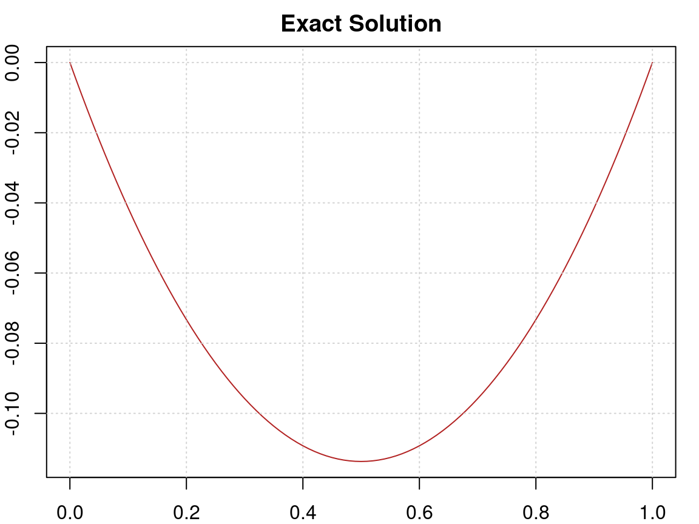
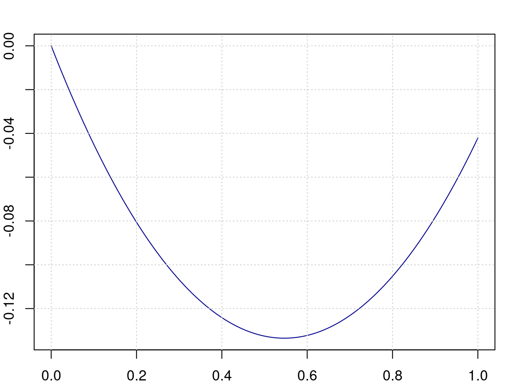
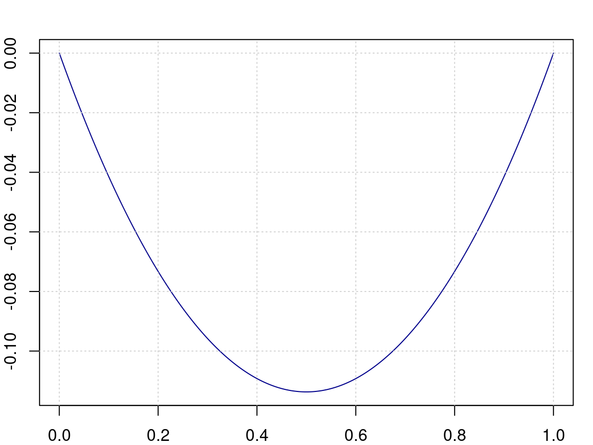
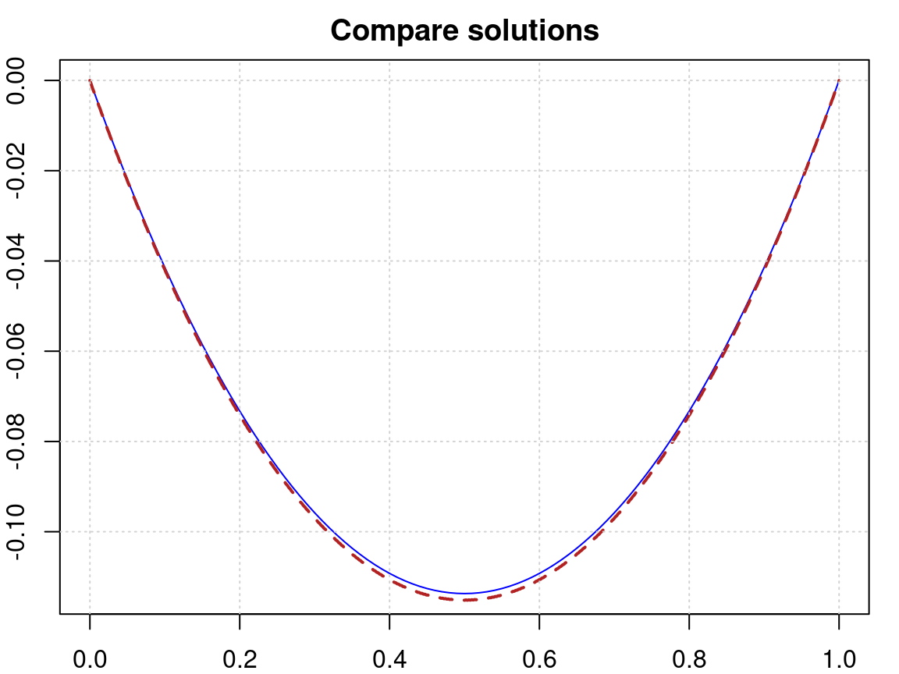

```r
library(pracma)
library(deSolve)
library(nloptr)

source("luksan17/rfunctions.R")  # cf. Appendix
```

## The Problem

The task is to find a (smooth) function $y(x)$ on $[0,1]$ that minimizes the following functional integral, Problem #17 in Luksan's sparse optimization test problems, see [here](http://hdl.handle.net/11104/0181697):

$$
  I(y) = \int_0^1 \big( \frac{1}{2} y'^2(x) + \exp(y(x)) - 1\big) dt
$$

with boundary conditions $y(0)=0$ and $y(1)= 0$.

To solve this problem as a numerical optimization problem, we will have to discretize it with, say, $n \approx 1000$ equidistant grid points on the interval from 0 to 1. The derivatives will be approximated through a *finite element difference formula* and the integral will be evaluated with the *simpson* or *trapezoidal* integration rule.

We will first find an exact solution, following the traditional 'calculus of variations' (CoV) way since Euler's times.


## Go 'Calculus of Variations'

### The Euler-Lagrange Equation

The general approach to solve such a 'calculus of variations' problem is to write down (and solve) the **Euler-Lagrange equation**. If the task is to minimize $\int F(x, y, y') dx$, then this equation will be

$$
\frac{\partial F}{\partial y} - \frac{d}{dx} \frac{\partial F}{\partial y'} = 0
$$

In our case, $F(x, y, y') = 1/2 y'^2 + \exp(y) - 1$ and the Euler-Lagrange equation is reduced to

$$
y''(x) = \exp(y(x))
$$

that is, a second-order differential equation with boundary conditions $y(0) = y(1) = 0$.

## The symbolic solution

We will try to solve this equation symbolically, i.e., with the help of the Computer Algebra System (CAS)  *Mathematica*. (Please note that the [Wolfram Cloud](https://www.wolfram.cloud/) does not have enough power or is not allowed to return a valid solution.)

With this input

```         
    > DSolve[y''[x] - Exp[y[x]] == 0, y[x], x]
```

the following symbolic solution is returned:

$$
y(x) = \log(\frac{1}{2} c1(-1 + \tanh^2(\frac{1}{2} \sqrt{c1 (x+c2)^2})))
$$

I was not able to force Mathematica to return numerical values for the constants $c_1$ and $c_2$, but a manual rearrangment allowed to conclude $c_1=-1.785044819891$ and $c_2=-0.5$, see the discussion on 
[stackoverflow](https://math.stackexchange.com/questions/5053678/).


For future use we will define these constants in R:

```r
c1 = -1.78504481989104354
c2 = -0.5
```

On the Stackoverflow page you see a further simplification that we will not use here. The final form of our solution is

$$
y(x) = \log\big(\frac{|c_1|}{2} sec^2(\frac{\sqrt{|c_1|}}{4}(1-2x))\big)
$$

and the following function is an R implementation, using 'sec' instead of 'sech' to avoid imaginary values.

```r
c1a = abs(c1)
f1 = function(x) log(c1a/2*pracma::sec(sqrt(c1a)/4*(1-2*x))^2)

par(mar=c(2,2,2,1))
plot(f1, 0, 1, col="firebrick",
     main="Symbolic Solution"); grid()
```



The minimum of this function is at $x=1/2$ with value $-0.1137036676$.

We will integrate the function, whose integral is to be minimized, numerically to get

```r
f2 = function(x) {
    0.5*pracma::fderiv(f1, x)^2 + exp(f1(x)) - 1
}

integrate(f2, 0, 1, rel.tol=1e-12)
```

to find a value for the integral to be minimized as

```
-0.03799204 with absolute error < 3.9e-14
```


### The Numerical ODE Solution

Instead we will compute a numeric solution for the differential equation based on *Runge-Kutta*-like DE solvers. As iterative methods, these algorithms will be more accurate than optimization methods.

The second-order equation is reformulated as a system of two first-order equations. Then we define the integrand in the usual way.

```r
f_ode = function(x, y, ...) {
    dy1 = y[2]
    dy2 = exp(y[1])
    return(list(c(dy1, dy2)))
}
```

We will apply deSolve::ode with method 'lsoda', that implements a Runge-Kutta solver. The integration limits are 0 and 1, and the function and derivative values at 0 are 0 and -0.5 as a start.

```r
n = 512
xs = seq(0, 1, length.out=n+1)
sol = deSolve::ode(y=c(0,-0.5), times=xs, f_ode, parma=NULL, method="lsoda")
```



The number of points is 512; this is the highest number of subintervals that is acceptable for our optimization procedures.


### The Shooting Method

Now we must ensure that the function value at $x=1$ is also 0. To do this we employ the **shooting method** and vary the slope at $x=0$ such that the function value at $x=1$ will also be 0. The `uniroot` function of R will get this done for us.

```r
fct = function(y1) {
    # s = ode45(f_el, 0, 1, c(0, y1), hmax=0.01)
    s = deSolve::ode(y=c(0, y1), times=xs, f_ode, parma=NULL, method="lsoda")
    y1s = s[, 2]
    return(y1s[length(y1s)])
}

slp = uniroot(fct, c(-0.1, -0.9), tol = 1e-12)$root
cat("The slope at x=0 shall be", slp, '!')
```

```
The slope at x=0 shall be -0.4636326 !
```



```r
print(min(sol[, 2]), digits=12)
```

```
[1] -0.113703656779
```


### The value of the functional integral

The list values that `sol_el` returns enable us to calculate the minimal value of the integral manually.

```r
x1 = sol[, 1]
y1 = sol[, 2]
y2 = sol[, 3]
ys = 0.5*y2^2 + exp(y1) - 1.0
t = pracma::trapz(x1, ys)
cat("The minimal value of the functional integral is", t, '.')
```

```
The minimal value of the functional integral is -0.03799145 .
```


## The numerical optimization solution

### The objective function

We define an objective function with 99 variables and prepending and appending the the constraints $y(0)=0$ and $y(1)=0$. The derivatives are calculated with the `gradient` function in *pracma*, and the function is integrated with the `trapz` function from *pracma* again.


```r
n = 512; h = 1/n
fobj = function(y) {
    # length(y) == n-1
    xx = seq(0, 1, length.out=n+1)   # equidistant grid from 0 to 1
    yy = c(0.0, y, 0.0)              # constraints added
    dy = fe5der(yy, h)
    fn = 0.5*dy^2 + exp(yy) - 1.0   # function F discretized
    pracma::trapz(xx, fn)           # integral as tapezoidal rule
}
```

We minimize the integral with a gradient-based solver such as `ucminf`.

```r
x0 = numeric(n+1)
for (i in 1:(n+1)) x0[i] = (i-1)*h*(1 - (i-1)*h)
sol = nloptr::lbfgs(numeric(n-1), fn = fobj,
            control=list(maxeval=1000, xtol_rel=1e-8))
cat("The minimal value of the functional integral is", sol$value)
```

```
The minimal value of the functional integral is -0.03801322
```

Compare this with a value of -0.03799204 calculated with the approach of calculating the minimum through solving the Euler-Lagrange equation numerically.

We can compare the two solutions by overlaying them. The following plot shows the solution obtained by numerical optimization as points, and the numerical solution of the Euler-Lagrange equation as a solid line.

{width=576}


One can see how much the two solutions coincide, one the solution of the Euler-Lagrange equation, the other the solution of a minimization problem. The maximal absolute difference between these solutions is $7.15e-05$.

The differences stem from the numerical computations, but also from the discretization of the problem. Increasing the number of variables, for instance to $n \approx 1024$, will lead to a higher accuracy.


## Appendix

### Final Comparison

| method        | fmin          | integral min  | comment        |
|---------------|---------------|---------------|----------------|
| symbolic ODE  | -0.1137036676 | -0.03799204   | + num. integr. |
| numeric ODE   | -0.1137036568 | -0.03799145   | + num. integr. |
| numeric optim | -0.1196984    | -0.03801322   | ucminf, nloptr |
| approximation | -0.1140122    | -0.03798849   | parabolic      |

The solution looks almost like a parabolic, a polynomial of degree 2 -- but is not. I have approximated it by such a curve and calculated the minimum of the corresponding integral.

### Function 'f5der.R'

The following function takes function values 'y' at "equally distant" grid points with distance 'h' and calculates the derivative at these points.

```r
fe5der = function(y, h) {
    n = length(y)
    if (n < 5) stop("Length of y >= 5 required.")
    dy = numeric(n)
    
    # 5-point forward difference formula
    dy[1] =  (-25*y[1] + 48*y[2] - 36*y[3] + 16*y[4] - 3*y[5]) / (12*h)
    dy[n] = -(-25*y[n] + 48*y[n-1] - 36*y[n-2] + 16*y[n-3] - 3*y[n-4])/(12*h)
    
    # 5-point backward difference formula
    dy[2]   =  (-3*y[1] - 10*y[2] + 18*y[3] - 6*y[4] + y[5]) / (12*h)
    dy[n-1] = -(-3*y[n] - 10*y[n-1] + 18*y[n-2] - 6*y[n-3] + y[n-4]) / (12*h)
    
    # 5-point midpoint difference formula
    for (k in 3:(n-2)) {
        dy[k] = (-y[k+2]+8*y[k+1]-8*y[k-1]+y[k-2]) / (12*h)
    }
    return(dy)
}
```
