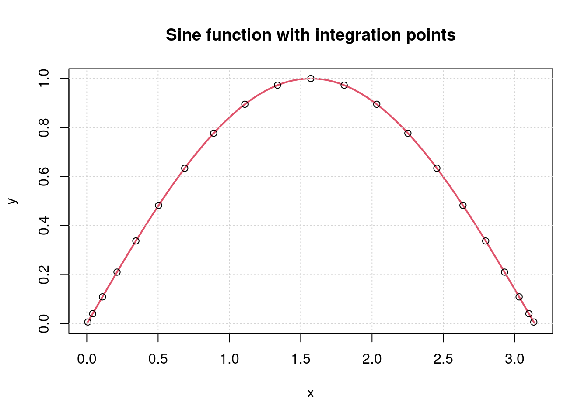
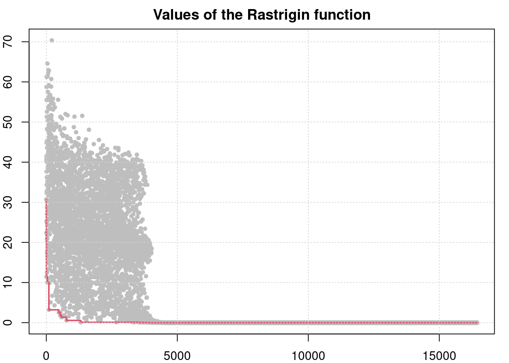
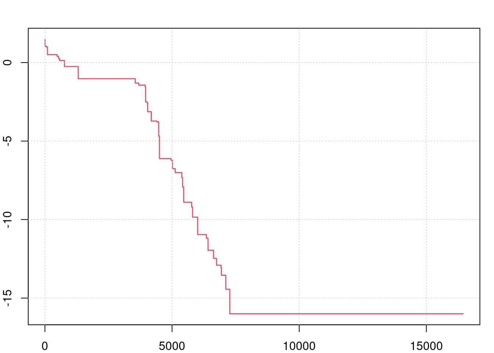
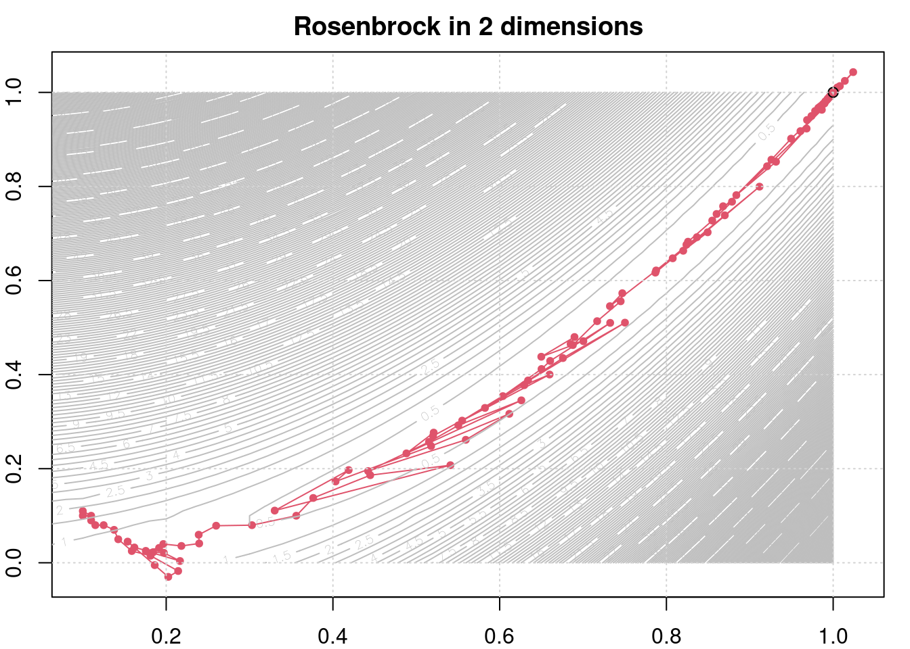
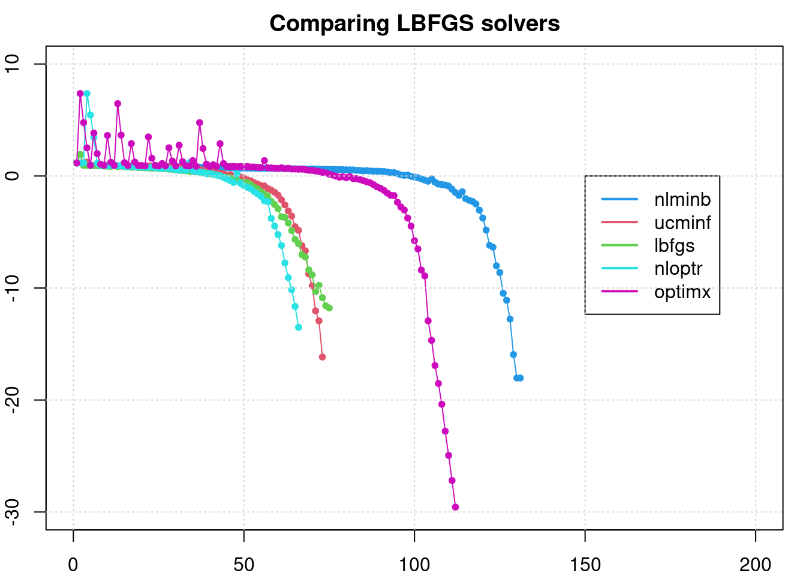

# 'Historize' a Function

Author: Hans W Borchers  
Date: 2023-10-10

## Introduction

Some numerical routines apply user-defined functions to process a task, for example integration routines, optimization or differential equation solvers. The functions are called internally, without it being clear at which points and with which result. 

For debugging purposes, or visualization or understanding of the algorithm used  it would be useful to know these function calls. This will often be achieved by modifying the function so that it writes input parameters and results into an external file for each call.

The 'Historize' function takes a different approach. The user-defined function is automatically modified to take down each call in an internal memory. This memory can later be read or erased for a new application. The user himself does not have to change the code of the function.


## Usage

The `Historize()` function is defined in the R package 'adagio' and will be applied to a user-defined function `fun` as follows.

```r
library(adagio)
Historize(fun, len = 0, ...)
```

`fun` is a function of one or several variables. If `len = 0` then only the function values will be stored, and if `len > 0` then all input variables will be stored in a matrix, one line for every call, and function values will be stored in a vector (the function shall return only a single real value). The dots, `...`, indicate additional parameters of the function.

Like `Vectorize` in Base R, `Fn = Historize(fn)` returns an identical, but 'historized' version of the original function `fn` (often denoted with a capital first character to distinguish it from the original). The new function will store function values for every call in a matrix or vector.

To return or clear the storage, call `Fn()` resp. `Fn(NULL`.

```r
Fn = Historize(fn)  # generate a `historized` version
Fn(x); ...          # call `fn` several times
A = Fn()            # load the history into matrix (or vector) A
Fn(NULL)            # clear the storage
```

The result of `Fn()` will be a list with components `input` and `values`, and `npars` `ncalls` for the number of input variables and the number of calls.

Filling the storage will take extra time and can slow down the function calls. Especially also storing the variables used in the call (with len>0) will make it considerably slower.

Functions can have multivariate output; the user is asked to take care of handling the output vector or matrix correctly. The function may even require additional parameters that can be provided through the `...` mechanism.

::: {.callout-note}
The new version of `Historize` will be part of *adagio* Version 0.9.1. This version is not yet on CRAN, but can be downloaded from R-Forge.
:::


## Examples

### Example 1: Integration

Which points are evaluated when integrating a function such as `sin(x)`?

```r
Fn <- Historize(sin, len = 1)
integrate(Fn, 0, pi)
H <- Fn()
H
```

    $input
                 [,1]
     [1,] 1.570796327
     [2,] 0.040987529
     ...

    $values
     [1] 1.000000000 0.040976054 ...
    
    $nvars
    [1] 1
    
    $ncalls
    [1] 21


There was one input variable and 21 function calls. We can visualize where the sine function was called.

```r
plot(sin, 0, pi, col = 2, lwd = 2,
     xlab = 'x', ylab = 'y', main ="Sine function with integration points")
points(H$input, H$values, col = 1)
grid()
```




## Example 2: Rastrigin function

We will use the *Rastrigin* function that has very many local minima in the domain $[-5.2, 5.2]^n$ even for small $n$. 

```r
fn <- adagio::fnRastrigin
Fn <- Historize(fn, len = 2)
lb = rep(-5.2, 2); ub = rep(5.2, 2)
```

```r
Fn(NULL)
sol <- adagio::simpleDE(Fn, lb, ub)     # a simple DE solver
H <- Fn()$values
Hc <- cummin(H)

par(mar = c(2, 2, 2, 1))
plot(H, pch = 20, col = "gray",
     main = "Values of the Rastrigin function")
lines(Hc, lwd = 2, col = 2)
grid()
```



It may look like the search for the minimum did not improve after 3000 iterations. We will look more closely at the minimum found at each iteration (adding `1e-16` to avoid `-Inf`values that would not be plotted) -- and using a `log10()` for a better view.

```r
par(mar = c(2,2,2,1))
plot(log10(Hc + 1e-16), type = 'l', lwd = 1.5, col = 2); grid()
```



There are relevant improvements even after 5000 iterations (up to about 7000 iterations). It is interesting to see how a "Differential Evolution" approach concentrates on a good solution after having found it.


### Example 3: Nelder-Mead and Rosenbrock

We want to visualize how a Nelder-Mead solver follows the "banana valley" defined by the infamous Rosenbrock function (in 2 dimensions).

```r
fn <- adagio::fnRosenbrock
x0 <- c(0.1, 0.1)
lb <- c(0.0, 1.0); ub <- lb

Fn <- Historize(fn, len = 1)
Fn(NULL)
sol <- optim(x0, Fn, method = "Nelder-Mead")
H1 <- Fn()$input

par(mar = c(2,2,2,1))
plot(H1, pch = 20, col = 2, # xlim = c(0, 1.2), ylim = c(0, 1.2),
     main = "Rosenbrock in 2 dimensions")
lines(H1, col = 2); points(1.0, 1.0)
lvls <- c(seq(1.0,, 9.0, len = 9), seq(10, 100, len=10))

x <- y <- seq(0.0, 1.0, length.out = 51)
z <- matrix(0, 51, 51)
for (i in 1:51) {
    for (j in 1:51) {
        z[i, j] <- fn(c(x[i], y[j]))
    }
}

contour(x, y, z, col = "gray", nlevels = 201, add = TRUE)
grid()
```



### Example 4: Compare LBFGS Solvers

We will compare the following BFGS solvers in R:

* nlminb (in Base R)
* ucminf::ucminf
* lbfgs::lbfgs
* nloptr::lbfgs
* optimx:optimr with `method="nvm"`

The test function is again the 'Rosenbrock' function, this time in 10 dimensions. For each solver we plot the values of function calls, utilizing `Historize` as done before. The result is the following plot, showing `log10` values of the objective function.

```r
#| echo: false
opar <- par(mar=c(2,2,2,1))
plot(0, 0, type = 'n', xlim = c(0, 200), ylim = c(-30, 10),
     main = "Comparing LBFGS solvers")

x0 <- rep(0.1, 10)
fn <- adagio::fnRosenbrock
Fn <- Historize(fn, len = 1)
gr <- adagio::grRosenbrock

Fn(NULL)
sol <- nlminb(start = x0, objective = Fn, gradient = gr)      # gradient = gr
H = Fn()
points(log10(H$values), pch = 20, col = 4, ylim = c(-20, 5))
lines(log10(H$values), col = 4)

Fn(NULL)
sol <- ucminf::ucminf(x0, Fn, gr, control = list(xtol = 1e-15, maxeval = 1000))
H = Fn()
points(log10(H$values), pch = 20, col = 2)
lines(log10(H$values), col = 2)

Fn(NULL)
sol <- lbfgs::lbfgs(Fn, gr, vars = x0, invisible = 1)
H = Fn()
points(log10(H$values), pch = 20, col = 3)
lines(log10(H$values), col = 3)

Fn(NULL)
sol <- nloptr::lbfgs(x0, Fn, gr)
H = Fn()
points(log10(H$values), pch = 20, col = 5)
lines(log10(H$values), col = 5)

Fn(NULL)
sol <- optimx::optimr(x0, Fn, gr, method = 'nvm')
H = Fn()
points(log10(H$values), pch = 20, col = 6)
lines(log10(H$values), col = 6)

legend(150, 0, col = c(4,2,3,5,6), lty = 1, lwd = 2,
       legend = c("nlminb", "ucminf", "lbfgs", "nloptr", "optimx"))
grid()
```



As the minimum is 0.0, we see that all these solvers converge quite nicely to the minimum. `nlminb` is the slowest, while `nloptr::lbfgs`, `lbfgs::lbfgs`, and `ucminf::ucminf` converge quite similar. These are the state-of-the-art solvers available for R users. `optimr` with "variable metric" is implemented by John Nash, coded in pure R and probably a bit slower.


### Example 5: Differential Equations

To be done.


## Appendices

### 'Historize' Function

```r
Historize <- function (fun, len = 0, ...) {
    stopifnot(is.function(fun))
    if (len != floor(len) || len < 0) 
        stop("Argument 'len' must be a non-negative integer.")
    local({
        H1 <- H2 <- numeric()
        myFun <- function(x, ...) {
            if (missing(x)) {           # return storage
                if (len == 0) {
                    m1 <- 0; m2 <- length(H2)
                    return(list(input=H1, values=H2, nvars = 1, ncalls = m2))
                } else {
                    m1 <- length(H1); m2 <- length(H2)
                    if (m2 == 0) {
                        return(list(input = NULL, values = NULL,
                               nvars = 0, ncalls = 0))
                    } else if (m1 %% m2 != 0) {
                        error("Input length not consistent with no. of calls.")
                    } else {
                        n <- m1/m2
                    }
                    H1m <- matrix(H1, ncol = n, byrow = TRUE)
                    return(list(input=H1m, values=H2, nvars = n, ncalls = m2))
                }
            }
            else if (is.null(x)) {      # clear storage
                H1 <<- H2 <<- numeric()
                return(invisible(NULL))
            }
            else {
                y <- fun(x, ...)
                if (len == 0) {
                    H2 <<- c(H2, y)     # function values
                }
                else {
                    H1 <<- c(H1, x)     # input values
                    H2 <<- c(H2, y)     # function values
                }
                return(y)
            }
        }
        return(myFun)
    })
}
```

### 'unVectorize' Function

For a "historized" function 'Fn' to work correctly it is required that
the origin function 'fn' is *not* vectorized. But some R procedures,
e.g. `integrate()`, apply the integrand to vectors. In such a case 'Fn'
has to be "unvectorized", that is it will only be applied to scalars.
This can be forced by

    Fnn = function(x) { lx = length(x); y = numeric(lx)
      for (i in 1:lx) y[i] = Fn(x[i])
      return(y)
  }

and then using 'Fnn' in the application, but 'Fn()' for retrieving the
generated function values (or variable and function values).
