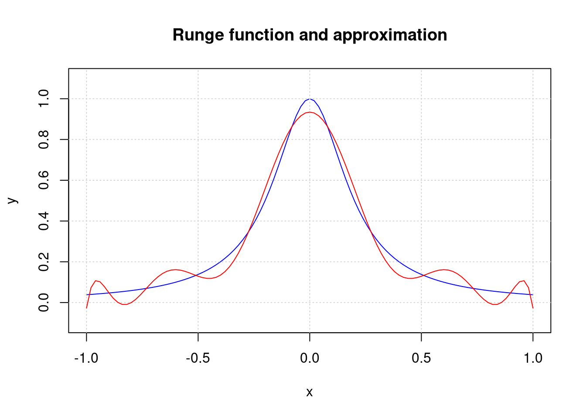

# The Remez problem

* [What is the Remez problem](#what-is-the-remez-problem)
* [Solve the discrete Remez problem](#solve-the-discrete-remez-problem)
  * [Solve as convex problem](#solve-as-convex-problem)
  * [Solve as constrained problem](#solve-as-constrained-problem)
* [Apply the Remez algorithm](#apply-the-remez-algorithm)
  * [MATLAB](#matlab)
  * [Julia](#julia)
  * [R package minimaxApprox](#r-package-minimaxapprox)
* [An example](#an-example)
* [References](#references)

## What is the Remez problem?

The **Remez problem** is the task to find or calculate the best polynomial approximation of a continuous function $f$ on a closed interval $[a, b]$, such that the maximum absolute distance between the polynomial $p$ and the function is minimized,

$$
\min_p ! \max_x |p(x) - f(x)|
$$

where the maximum is taken over all points in the interval.

Most of the time, statisticians are interested in least-squares $L_2$ or $L_1$ approximations. But such an $L_{\infty}$ solution can be important, e.g., if one has to guarantee the a polynomial approximation is accurate within a specific $\epsilon$ distance from the true function value on a whole interval.

The **Remez algorithm** (Remez 1934) is a complicative iterative procedure that has problems with floating-point precision. So there are not so many correct implementations in open-source software. The result is called the *minimax approximation*. See the Wikipedia article
[Remez algorithm](https://en.wikipedia.org/wiki/Remez_algorithm)
for a short overview of the algorithm and its numerical problems with stability, and some more references.

We will show how a discretized form of the Remez problem can be quite accurately solved in R as a convex problem resp. as a *minimax* problem with constrained optimization solvers. The difference to the true solution is relatively small.

We will also show how existing Remez implementations in MATLAB or Julia can be called. Since short time there is also a first implementation in R that can be downloaded from CRAN. Our consistent example for the rest of the note will be the Runge function which is well-known for its problem with oscillations at the edges of the interval $[-1, 1]$

$$
\mathrm{Runge}(x) = \frac{1}{1 + (5x)^2}
$$

which is well-known for its problem with oscillations at the edges of the interval $[-1, 1]$.


## Solve the 'discrete' Remez problem

### Solve as convex problem

Remember that the Vandermonde matrix $A = A(x_1, \ldots, n_n)$ of $n$ grid points has the property that given a polynomial $p$ as a vector, the expression $p(x) = A\,p$ will return the fitted values $p(x)$ of the polynomial at the points $x$.

We compute the Vandermonde matrix as an outer product.

```
library(pracma)
library(CVXR, warn.conflicts = FALSE)

fnRunge <- function(x) 1.0 / (1 + 25*x^2)

n <- 101; m = 11            # polynomial of degree 10
x <- seq(-1, 1, length=n)   # 101 grid points
y <- fnRunge(x)             # apply Runge's function

A <- outer(x, (m-1):0, '^') # Vandermonde matrix
```

Now we can formulate the minimax request as minimizing the expression `max(abs(y - A %*% p))` in the syntax required by the 'CVXR' package.

```r
p <- Variable(11)                             # 11-dimensional variable
objective <- Minimize(max(abs(y - A %*% p)))  # minimax objective
problem <- Problem(objective)                 # problem w/o constraints
result <- solve(problem)                      # call convex solver
p = result$getValue(p)                        # get the optimal value
result$value
```

    [1] 0.06547174

The maximal distance between the discrete points on the Runge function and its polynomial approximation is 0.06547174. Because these are not *all* the points on the Runge function, the actual distance between the function and the approximation will be slightly bigger (see below that the true value is 0.7% higher).

Of course, the result will be more accurate when more grid points are used. For example, with 1001 points the minimax distance will be 0.06590128, now correct for 4 digits.

Here is a plot showing the Runge function and its polynomial minimax approximation of degree 10. 

```r
plot(x, y, type ='l', col = "blue",     # plot the Runge function
     ylim = c(-0.1, 1.1), main = "Runge function and approximation")
grid()
yp <- polyval(c(p), x)                  # calculate the fitted values
lines(x, yp, col ="red")                #   and plot them in red
```



As a complex-analytic function, Runge has a pole at $0 + 0.2\,i$ that prevents polynomials to approximate it as well as one would expect.

### Solve as constrained problem

We could be tempted to solve this as a simple minimization problem, but beware: the objective function $\max_x |y - p(x)|$ is *nonsmooth* because of the absolute value function involved. Most optimization solvers will fail to find the correct minimum.

Instead -- as is common practice for minimax problems -- we add another variable, convert the objective function into a smooth one, and put all the minmax conditions into the constraints.

```r
library(nloptr)

n <- 101; m = 11            # polynomial of degree 10
x <- seq(-1, 1, length=n)   # 101 grid points
y <- fnRunge(x)             # Runge function

fn <- function(p) p[12]     # return only the new variable

hin <- function(p) {        # maximum conditions as constraints
    h <- y - polyval(p[1:11], x)
    return( c(p[12] + h, p[12] - h) )
}
```

The two terms in `c(p[12] + h, p[12] - h)` are needed to replace the absolute value, i.e., the constraints are smooth, too. In total we get more than 200 constraints, so a quite powerful constraint solver is needed.

Now call `slsqp` from the 'nloptr' package. 

```r
x0 <- c(rep(1.0, 11), 1.0)
sol <- slsqp(x0, fn, hin = hin,
             control = list(maxeval = 2000, xtol_rel = 1e-15))

cat("Minimax distance:", sol$value, '\nSolution parameters:\n')
```

    Minimax distance: 0.0654678 
    Solution parameters:

```r
zapsmall(sol$par)
```

     [1]  -50.24826    0.00000  135.85352    0.00000 -134.20107    0.00000
     [7]   59.19316    0.00000  -11.55888    0.00000    0.93453    0.06547

The minimax distance is slightly smaller as with a convex solver; this no surprise as convex solvers are in general more accurate.


## Apply the Remez algorithm

There are several implementations of the Remez algorithm, in MATLAB, in Julia, in Python, and since short in R. All these codes are based somehow on the article by Pachon and Trefethen (2008), see the references.

### MATLAB

In MATLAB, calling the Remez algorithm by Nick Trefethen and colleagues from Oxford University is very simple. We assume that the 'Chebfun' module is in the MATLAB path, then

```octave
% Make a chebfun of Runge's function
f = chebfun( @(x) 1 ./ ( 1 + 25*x.^2 ) );

% Get the best approximation using Remez
cr = remez( f , 10 );

% Get the maximum error
fprintf( 'maximum error of chebfun remez: %e (%f s)\n' , norm( f - cr , inf ));
```

    maximum error of chebfun remez: 6.592293e-02

This is the true minimax distance of Runge's function and the minimax polynomial of degree 10, computed with the best available free software, accurate to 15 digits.

In MATLAB it is also possible to apply the original CVX software by Boyd and his Stanford group, available as free software.

```octave
m = 101; n = 11;            % 101 points, polynomial of degree 10
xi = linspace(-1, 1, m);    % equidistant points in [-1, 1]
ri = 1 ./ (1+(5*xi).^2);    % Runge function

tic                         % p is the polynomial of degree (n-1)
cvx_begin                   % minimize the distance in all points
    variable p(n);
    minimize( max(abs(polyval(p, xi) - ri)) );
cvx_end
toc                         % 0.17 sec for Matlab, CVX and SeDuMi
```

Here we can directly use the `polyval` function, which is not possible in the R syntax of CVXR. The result is a minimax distance of 0.0654, same as above with CVXR. See my discussion on [StackExchange](https://scicomp.stackexchange.com/questions/1531/the-remez-algorithm)
with Pedro from the Chebfun team about comparing the two approaches and the accuracy of results (and why that matters).

### Julia

For Julia we utilize the 'Remez.jl' package that can be downloaded and installed from the main Julia servers. Then call `ratfn_minimax` with the function name, the interval, and the degrees of the numerator and denominator polynomials. We set the later to 0 to prevent any polynomial denominatot.

```julia
julia> using Remez
julia> @. runge(x) = 1.0 / (1.0 + (5.0 * x)^2)    # Runge function
julia> N, D, E, X = ratfn_minimax(runge, [-1.0, 1.0], 10, 0);
julia> E
julia> float(N)
```
    0.0659229266608402

    11-element Vector{BigFloat}:
        0.9340770733391597
       -4.3052651518119263e-55
      -11.5530156918588831
        1.7372592302396026e-53
       59.1718922314996475
       -8.5939707001636868e-53
     -134.1552503674891540
        1.1735594422217025e-52
      135.7959650680182781
       -4.7273337541126141e-53
      -50.2211297017083501

Actually, 'Remez.jl' applies higher-precision numbers ("big numbers") to minimize the effect of inaccuracies in floating-point calculations. I have shortened the output to 16 digits. The minimax distance is 0.06592293 compared to the 0.06547174 result from a discretised optimization.

### R package 'minimaxApprox'

There is a new package on CRAN that attempts to implement the Remez algorithm in pure R. It is usable, but there appear to be bugs. When we ask for a polynomial approximation of degree 10, we get an error message.

```r
library(minimaxApprox)
from <- -1.0; to <- 1.0
fnRunge <- function(x) 1/(1 + (5 * x)^2)
sol <- minimaxApprox(fn = fnRunge, from, to, degree = 10)
```

    ## Error in solve.default(polyMat(x, y, relErr), y) :
    ##  system is computationally singular:
    ##  reciprocal condition number = 2.00539e-19

Instead we will try degree 11 hoping for a result that can be interpreted in polynomial degree 10, too.

```r
sol <- minimaxApprox(fn = fnRunge, from, to, degree = 11)
sol$a
```

     [1]  9.340771e-01 -1.855657e-15 -1.155302e+01  3.126176e-13  5.917189e+01
     [6] -1.939782e-12 -1.341553e+02  4.249187e-12  1.357960e+02 -3.850310e-12
    [11] -5.022113e+01  1.230144e-12

and with an 'observed' resp. 'expected' error of 0.06592293.

The highest coefficient is almost 0, so forgetting it will leave us with a vector of length 11, or as a coefficient vector of a 10th degree polynomial. We calculate the minimax error manually (for applying 'pracma's `polyval` function we have to reverse the coefficients):

```r
p <- rev(sol$a[1:11])
max(abs(pracma::polyval(p, x) - y))
```

    [1] 0.06592293

We also see that the uneven coefficients are very small. The reason is that the Runge function is 'even', i.e., `fnRunge(-x) = fnRunge(x)`. If we set all these coefficients to 0, the result is not as good as before.

```r
p <- rev(zapsmall(sol$a[1:11]))
max(abs(pracma::polyval(p, x) - y))
```

    [1] 0.06592154

This indicates that the coefficients that `minimaxApprox` produces are not really accurate. We hope for further approvements in this package. 

## An example

The Remez algorithm is often utilized in Signal processing for the problem of optimal signal design. Here we will apply it to function approximation, verifying an approximation in the "Handbook of Mathematical Functions" by Abramovichand Stegun.

For the Gamma function on the interval $[1, 2]$ the following polynomial approximation is given (on p. 257) as

$$
\Gamma(x+1) = 1 + a_1 x_1 + a_2 x_2^2 + a_3 x_3^3 + a_4 x_4^4 + a_5 x_5^5 + \epsilon(x)
$$

with coefficients $a_1, \ldots, a_5$ and a maximal error of $\epsilon(x) \le5 \cdot 10^{-5}$. We will try to veryfy this as a minimax approximation.

```r
from <- 0.0; to <- 1.0
fn <- function(x) gamma(x+1)
a <- c( 1.0,                # coefficients as in the Handbook
       -0.5748646,
        0.9512363,
       -0.6998588,
        0.4245549,
       -0.1010678)
```

Now apply the Remez algorithm to `fn` and compare coefficients,

```r
library(minimaxApprox)
sol <- minimaxApprox(fn = fn, from, to, degree = 5)

cat("Max approximation error", sol$OE, '\n\n')
```

    Max approximation error 3.711925e-05 

```r
cbind(a, sol$a)
```

                  a           
    [1,]  1.0000000  0.9999629
    [2,] -0.5748646 -0.5741662
    [3,]  0.9512363  0.9478703
    [4,] -0.6998588 -0.6937216
    [5,]  0.4245549  0.4201384
    [6,] -0.1010678 -0.1001209

and we can see that the handbook approximation has been refined to return exactly 1.0 at the endpoints of the interval -- with the effect of slightly enlarging the error.

We can plot the two error curves.

```r
pn1 <- function(x) polyval(rev(a), x)
pn2 <- function(x) polyval(rev(sol$a), x)

xs = seq(0, 1, len=1000)
y1 = fn(xs) - pn1(xs)
y2 = fn(xs) - pn2(xs)
plot(xs, y1, type = 'l', lwd=2, col=4,
     main = "Errors for the Gamma function approximation")
lines(xs, y2, col=2, lwd=2); grid()
```


The blue line displays the error of the Handbook function, the red line the error of the minimax Approximation on the interval $[0, 1]$.


## References

Abramowitz/Stegun, Handbook of Mathematical Functions. 1964/1972.
URL: http://www.convertit.com/Go/ConvertIt/Reference/AMS55.ASP

R. Pachon and L.N. Trefethen.
"Barycentric-Remez algorithms for best polynomial approximation in the chebfun system". BIT Numerical Mathematics (2008) Vol. 46.  
URL: https://people.maths.ox.ac.uk/trefethen/publication/PDF/2009_132.pdf

E.Ya. Remez. "Sur le calcul effectiv des polynômes d’approximation de Tschebyscheff". Compt. Rend. Acad. Sc., 1934, 199, S. 337–340.

Abiy Tasissa. "Function approximation and the Remez algorithm". Tufts University, 2019, and Universitá di Padova, 2021.  
URL: https://sites.tufts.edu/atasissa/files/2019/09/remez.pdf
